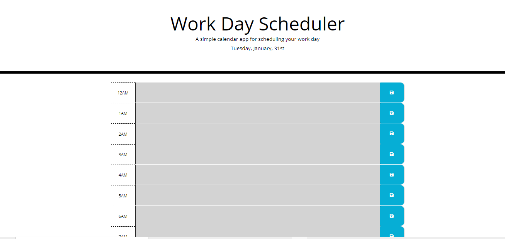
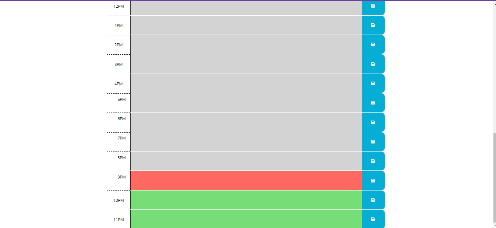

# Third-Party APIs: Calendar app

## Description

Created a simple calendar application that allows us to save events for each hour of the day.

have used moment.js library file to work with date and time.

# Deployed Link:

https://kalpana-sivaprakash.github.io/module-07-challenge/

# Repository Link:
https://github.com/Kalpana-Sivaprakash/module-07-challenge

## Installation
N/A

## Usage 
This is the simple calendar application used to save the events or information on hourly basis.

## Credits
N/A

## License
MIT license

## Features
N/A

## Contributing
N/A